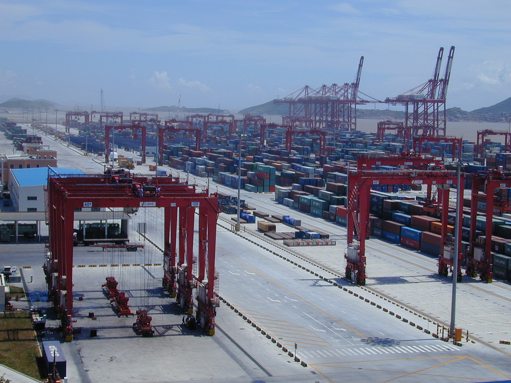

# Gantry

Move container images to and from [IPFS](https://ipfs.io/).

> A container crane (also container handling gantry crane or ship-to-shore crane) is a type of large dockside gantry crane found at container terminals for loading and unloading intermodal containers from container ships.

Also...

> A tall framework supporting a space rocket prior to launching.

The [Open Container Initiative](https://www.opencontainers.org/) currently maintains specifications for [images](https://github.com/opencontainers/image-spec)
and [runtimes](https://github.com/opencontainers/runtime-spec) which have been implemented by the [containers organization](https://github.com/containers), including 
libraries such as [this](https://github.com/containers/storage) and tools such as [Buildah](https://github.com/containers/buildah) and [Podman](https://github.com/containers/libpod). 

Gantry adapts some simple interfaces to further leverage IPFS as a storage backend to host all layers that comprise an image, located 
at the Content Identifier (CID) of it's manifest. This allows anyone with knowledge of the manifest to pull the whole image from anywhere in the world. 



## Getting Started

Requirements:
 - [go-ipfs](https://github.com/ipfs/go-ipfs)
 - [buildah](https://github.com/containers/buildah)

Download any image to your local store:

```bash
buildah from alpine
```

The only way to publish an image is to run a local IPFS node.
You can then push the image to the running daemon, and clear the local image store:

```bash
image=$(gantry push -o alpine)
buildah rmi --all
```

Finally, re-download the image from IPFS and check it exists:

```bash
gantry pull -o $image -t alpine
buildah images
```

## Troubleshooting

You may need to enable user namespace cloning in the kernel:

```bash
sysctl -w kernel.unprivileged_userns_clone=1
```